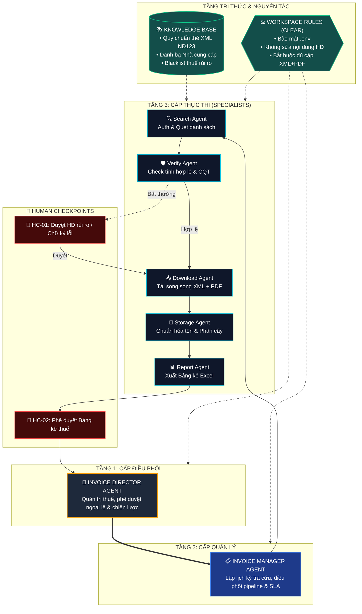

# HỆ THỐNG TỰ ĐỘNG HÓA HÓA ĐƠN MUA VÀO (GDT INVOICE AGENTIC WORKSPACE)

> **Dự án cuối khóa (Capstone Project):** AI for Work Advanced  
> **Đề tài:** Hệ thống Tự động hóa tìm kiếm, tải và lưu giữ hoá đơn mua vào thông qua Cổng thông tin Tổng cục Thuế (`hoadondientu.gdt.gov.vn`)  
> **Nền tảng vận hành:** Google Antigravity Agentic Framework  
> **Tiêu chuẩn tuân thủ:** Nghị định 123/2020/NĐ-CP & Thông tư 78/2021/TT-BTC

---

## 1. TỔNG QUAN HỆ THỐNG & SỨ MỆNH (WORKSPACE MISSION)

Workspace này là hệ thống tác tử AI đa tầng (**Multi-Agent System**) được thiết kế chuyên biệt để giải quyết bài toán thu thập, kiểm tra, tải về và lưu giữ hóa đơn điện tử mua vào của doanh nghiệp từ Tổng cục Thuế. 

Hệ thống hoạt động theo nguyên tắc:
* **Tự động hóa tối đa (Automated):** Tiết kiệm 95% thời gian thủ công của kế toán.
* **Toàn vẹn tuyệt đối (Non-Destructive):** Tải trọn bộ cặp file XML gốc (có chữ ký số) và PDF hiển thị mà không can thiệp sửa đổi nội dung hóa đơn.
* **Kiểm soát thông minh (Human-in-the-Loop):** Chỉ yêu cầu con người can thiệp tại các điểm rủi ro thực sự (Chữ ký số lỗi, MST rủi ro cao, Captcha/OTP).

---

## 2. KIẾN TRÚC HỆ THỐNG 3 TẦNG & 7 THÀNH TỐ



---

## 3. CẤU TRÚC THƯ MỤC WORKSPACE (`demo-du-an`)

```text
demo-du-an/
├── AGENTS.md                                # Quy ước vận hành chính của Workspace
├── docs/                                    # Hồ sơ phân tích & thiết kế kỹ thuật
│   ├── 01_scope_analysis.md                 # Phân tích bài toán theo khung SCOPE
│   ├── 02_architecture_system_design.md     # Thiết kế kiến trúc 3 tầng & 7 thành tố
│   ├── 03_clear_rules_and_handoff.md        # Quy tắc CLEAR & Cơ chế Handoff JSON
│   ├── 04_human_checkpoints_hitl.md         # Quy chuẩn điểm kiểm soát con người (HITL)
│   └── 05_test_matrix_and_guardrails.md     # Kịch bản kiểm thử 3 case & Ma trận sự cố
├── .agents/                                 # Kỹ năng đóng gói cho các Agent
│   └── skills/
│       ├── gdt-invoice-searcher/SKILL.md    # Kỹ năng cho Invoice Search Agent
│       ├── gdt-bulk-downloader/SKILL.md     # Kỹ năng cho Invoice Download Agent
│       └── invoice-smart-filer/SKILL.md     # Kỹ năng cho Invoice Storage Agent (Đa mẫu số)
├── knowledge-base/                          # Kho tri thức phục vụ tra cứu
│   ├── templates_guide.md                   # Hướng dẫn nhận diện Mẫu 1 (GTGT) & Mẫu 2 (Bán hàng)
│   └── tax_blacklist.json                   # Danh sách đen doanh nghiệp rủi ro cao về thuế
├── sample-data/                             # Dữ liệu luân chuyển thực hành (Handoff)
│   └── manifests/
│       ├── invoices_manifest.json           # Dữ liệu bàn giao: Search -> Download
│       └── download_status.json             # Dữ liệu bàn giao: Download -> Storage
└── outputs/                                 # Kết quả đầu ra lưu trữ chuẩn hóa
    ├── storage_catalog.json                 # Danh mục tổng hợp tất cả hóa đơn đã lưu
    └── HoaDon_MuaVao/                       # Cây thư mục hóa đơn phân loại Năm/Tháng/MST
        └── 2026/
            ├── 04/MauSo_1_GTGT/0301452948_NH_ACB/
            ├── 05/MauSo_2_BanHang/001065008691_HKD_NguyenQuocGiao/
            └── 06/MauSo_1_GTGT/0101893254_CoKhiNamHaNoi/
```

---

## 4. HƯỚNG DẪN TRÌNH BÀY SLIDE BÁO CÁO CAPSTONE

1. **Slide 1 — Problem Statement:** Sử dụng tài liệu `docs/01_scope_analysis.md` (Mục S - Situation & Nỗi đau mất 25h/tháng).
2. **Slide 2 — Ràng buộc & Mục tiêu:** Dùng `docs/01_scope_analysis.md` (Mục C - Constraints & Mục O - KPIs giảm 95% thời gian).
3. **Slide 3 — Sơ đồ Kiến trúc Multi-Agent:** Sử dụng sơ đồ Mermaid trong `docs/02_architecture_system_design.md`.
4. **Slide 4 — Cơ chế Handoff & Quy tắc CLEAR:** Sử dụng bảng CLEAR và luồng trạng thái JSON trong `docs/03_clear_rules_and_handoff.md`.
5. **Slide 5 — Human-in-the-Loop & Xử lý sự cố:** Trình bày bảng phân quyền HITL và Ma trận 3 trường hợp kiểm thử trong `docs/04_human_checkpoints_hitl.md` & `docs/05_test_matrix_and_guardrails.md`.
6. **Slide 6 — Demo & Kết quả đầu ra:** Minh họa cây thư mục thực tế trong `outputs/HoaDon_MuaVao/` và file `storage_catalog.json`.
