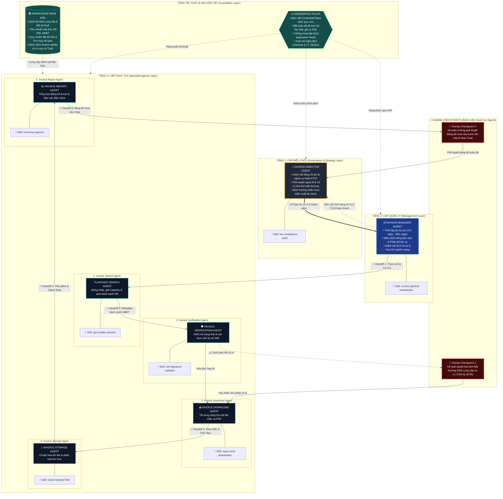

# THIẾT KẾ KIẾN TRÚC HỆ THỐNG AGENTIC WORKSPACE (7 THÀNH TỐ & 3 TẦNG)

---

## 1. SƠ ĐỒ KIẾN TRÚC TỔNG THỂ (MERMAID)

---

## 2. MA TRẬN 7 THÀNH TỐ HỆ THỐNG

| STT | Thành tố | Nội dung triển khai cụ thể |
| :---: | :--- | :--- |
| **1** | **Agents** | • Tầng 1: `Invoice Director Agent` • Tầng 2: `Invoice Manager Agent` • Tầng 3: 5 Specialist Agents (`Search`, `Verify`, `Download`, `Storage`, `Report`). |
| **2** | **Skills** | • `gdt-invoice-searcher` • `xml-signature-validator` • `gdt-bulk-downloader` • `invoice-smart-filer` • `excel-tax-reporter` |
| **3** | **Workflow** | Pipeline 5 giai đoạn: Auth $\rightarrow$ Query $\rightarrow$ Verify $\rightarrow$ Download $\rightarrow$ Organize $\rightarrow$ Report. |
| **4** | **Knowledge Base** | Cấu trúc thẻ XML NĐ123, Danh bạ NCC, Blacklist thuế, Mẫu số 1 & Mẫu số 2. |
| **5** | **Rules** | Khung CLEAR: Bảo mật credentials, không sửa nội dung hóa đơn, tải đủ cặp file, chống trùng lặp. |
| **6** | **Handoff** | Giao thức truyền dữ liệu JSON schema giữa các Agent (`invoices_manifest.json`, `download_status.json`, `storage_catalog.json`). |
| **7** | **Human Checkpoint** | HC-01 (Duyệt rủi ro/Chữ ký số) & HC-02 (Ký duyệt Bảng kê thuế trước khi kê khai). |
